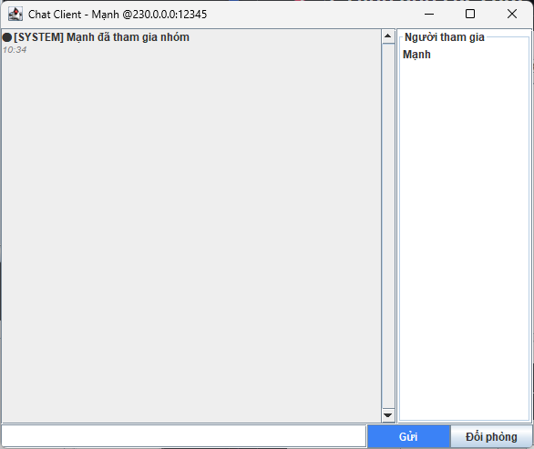
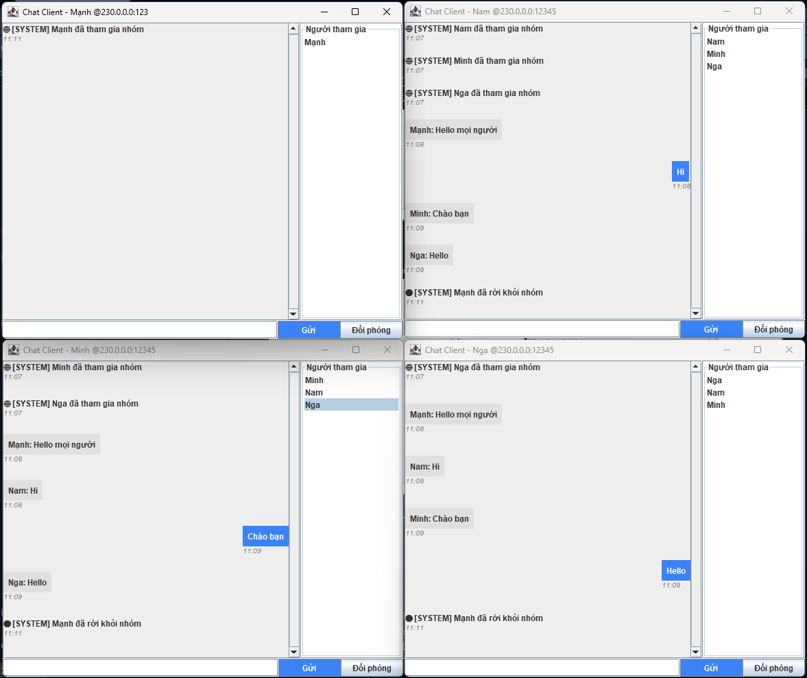

<h2 align="center">
    <a href="https://dainam.edu.vn/vi/khoa-cong-nghe-thong-tin">
    🎓 Faculty of Information Technology (DaiNam University)
    </a>
</h2>
<h2 align="center">
   TẠO CHATROOM SỬ DỤNG UDP MULTICAST
</h2>
<div align="center">
    <p align="center">
        
        
        
    </p>

[](https://www.facebook.com/DNUAIoTLab)
[](https://dainam.edu.vn/vi/khoa-cong-nghe-thong-tin)
[](https://dainam.edu.vn)

</div>

## 📖 1. Giới thiệu
Chat Room dùng UDP Multicast là một ứng dụng cho phép nhiều máy tính (hoặc nhiều tiến trình) cùng tham gia vào một “phòng trò chuyện” thông qua cơ chế truyền thông nhóm (multicast).

Trong mô hình này: các Client là các thành viên tham gia phòng chat, có thể gửi tin nhắn đến nhóm và nhận lại tin nhắn từ các thành viên khác.
## 🔧 2. Công nghệ và ngôn ngữ lập trình sử dụng
🔹 Ngôn ngữ lập trình sử dụng

Java

Dùng Java SE (Standard Edition), phiên bản phổ biến (Java 8 trở lên).

🔹 Môi trường lập trình

IDE: Eclipse IDE (Eclipse IDE for Java Developers).

Hệ điều hành: Windows.

JDK: Cần cài Java Development Kit (JDK 8 hoặc JDK 17).

Project Type: Java Project (trong Eclipse).

## 🚀 3. Hình ảnh các chức năng
<p align="center">
  
</p>
<p align="center">
  <em>Hình 1: Ảnh giao diện nhập tên của chat</em>
</p>
<p align="center">
  
</p>
<p align="center">
  <em>Hình 2: Ảnh giao diện chat Client</em>
</p>
<p align="center">
  
</p>
<p align="center">
  <em>Hình 3: Ảnh giao diện 1 người khác tham gia địa chỉ và nhắn tin</em>
</p>
Khi bấm nút "Đổi phòng" thì giao diện cũng không khác gì hình 1, chỉ là không có phần nhập tên
<p align="center">
  
</p>
<p align="center">
  <em>Hình 4: Ảnh giao diện 1 người trong nhóm chat đổi sang phòng chat mới</em>
</p>
## 📝 4. Hướng dẫn cài đặt và sử dụng

### 🔧 Yêu cầu hệ thống

- **Java Development Kit (JDK)**: Phiên bản 8 trở lên
- **Hệ điều hành**: Windows, macOS, hoặc Linux
- **Môi trường phát triển**: IDE (IntelliJ IDEA, Eclipse, VS Code) hoặc terminal/command prompt
- **Bộ nhớ**: Tối thiểu 512MB RAM
- **Dung lượng**: Khoảng 10MB cho mã nguồn và file thực thi

### Bước 1: Chuẩn bị môi trường
1. **Kiểm tra Java**: Mở terminal/command prompt và chạy:
   ```bash
   java -version
   javac -version
   ```
   Đảm bảo cả hai lệnh đều hiển thị phiên bản Java JDK 17 trở lên.

2. **Tải mã nguồn**: Sao chép thư mục `src/chatroom` chứa các file:
   - `ChatServer.java`
   - `ChatClient.java`
  
  #### Bước 2: Biên dịch mã nguồn và chạy ứng dụng
1. **Mở terminal** và điều hướng đến thư mục chứa mã nguồn
2. **Biên dịch các file Java**:
   ```bash
   javac src/chatroom/*.java
   ```
**Khởi động Server:**
```bash
java src/chatroom.ChatServer
```
- Giao diện server sẽ hiển thị, sẵn sàng nhận kết nối từ client

**Khởi động Client:**
```bash
java UngDungChat_TCP.ChatClient
```
- Nhập tên người dùng khi được yêu cầu (ví dụ: "Mạnh", "Nam", "Minh") và tên Port, Server mình muốn tạo và tham gia
- Client sẽ kết nối đến server và hiển thị giao diện chat
- Người khác có thể tham gia chat miễn sao nhập đúng Port và Server tương ứng

## Thông tin cá nhân
**Họ tên**: Đào Đức Mạnh.  
**Lớp**: CNTT 16-03.  
**Email**: manhseu2004@gmail.com.

© 2025 AIoTLab, Faculty of Information Technology, DaiNam University. All rights reserved.

---