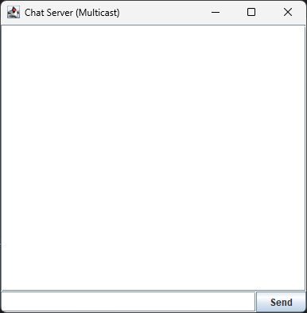
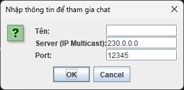
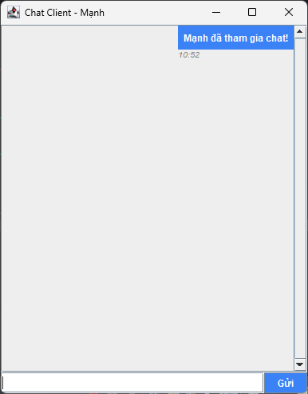
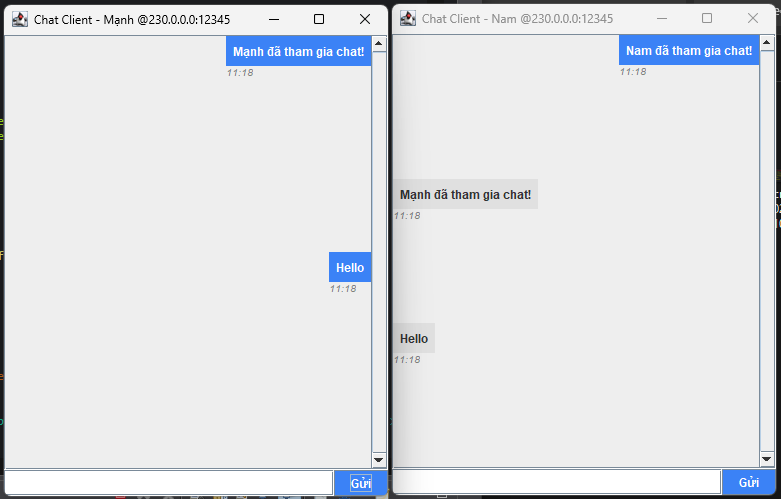

<h2 align="center">
    <a href="https://dainam.edu.vn/vi/khoa-cong-nghe-thong-tin">
    🎓 Faculty of Information Technology (DaiNam University)
    </a>
</h2>
<h2 align="center">
   TẠO CHATROOM SỬ DỤNG UDP MULTICAST
</h2>
<div align="center">
    <p align="center">
        
        
        
    </p>

[](https://www.facebook.com/DNUAIoTLab)
[](https://dainam.edu.vn/vi/khoa-cong-nghe-thong-tin)
[](https://dainam.edu.vn)

</div>

## 📖 1. Giới thiệu
Chat Room dùng UDP Multicast là một ứng dụng cho phép nhiều máy tính (hoặc nhiều tiến trình) cùng tham gia vào một “phòng trò chuyện” thông qua cơ chế truyền thông nhóm (multicast).

Trong mô hình này:

Server đóng vai trò quản lý phòng chat, gửi và nhận thông điệp từ nhóm multicast, đồng thời có thể phát tin nhắn đến tất cả Client.

Client là các thành viên tham gia phòng chat, có thể gửi tin nhắn đến nhóm và nhận lại tin nhắn từ các thành viên khác (kể cả từ Server).
## 🔧 2. Công nghệ và ngôn ngữ lập trình sử dụng
🔹 Ngôn ngữ lập trình sử dụng

Java

Dùng Java SE (Standard Edition), phiên bản phổ biến (Java 8 trở lên).

Thư viện sử dụng:

java.net.* (UDP, DatagramSocket, MulticastSocket, InetAddress).

javax.swing.* (tạo giao diện đồ họa).

java.awt.* (hỗ trợ bố cục giao diện).

🔹 Môi trường lập trình

IDE: Eclipse IDE (Eclipse IDE for Java Developers).

Hệ điều hành: Windows.

JDK: JDK 17

Project Type: Java Project (trong Eclipse).

## 🚀 3. Hình ảnh các chức năng
<p align="center">
  
</p>
<p align="center">
  <em>Hình 1: Ảnh giao diện chat Server </em>
</p>
<p align="center">
  
</p>
<p align="center">
  <em>Hình 2: Ảnh giao diện nhập tên của chat Client</em>
</p>
<p align="center">
  
</p>
<p align="center">
  <em>Hình 3: Ảnh giao diện chat Client</em>
</p>
<p align="center">
  
</p>
<p align="center">
  <em>Hình 4: Ảnh giao diện 1 người khác tham gia nhắn tin</em>
</p>

## 📝 4. Hướng dẫn cài đặt và sử dụng

### 🔧 Yêu cầu hệ thống

- **Java Development Kit (JDK)**: Phiên bản 8 trở lên
- **Hệ điều hành**: Windows, macOS, hoặc Linux
- **Môi trường phát triển**: IDE (IntelliJ IDEA, Eclipse, VS Code) hoặc terminal/command prompt
- **Bộ nhớ**: Tối thiểu 512MB RAM
- **Dung lượng**: Khoảng 10MB cho mã nguồn và file thực thi

### Bước 1: Chuẩn bị môi trường
1. **Kiểm tra Java**: Mở terminal/command prompt và chạy:
   ```bash
   java -version
   javac -version
   ```
   Đảm bảo cả hai lệnh đều hiển thị phiên bản Java JDK 17 trở lên.

2. **Tải mã nguồn**: Sao chép thư mục `src/chatroom` chứa các file:
   - `ChatServer.java`
   - `ChatClient.java`
  
  #### Bước 2: Biên dịch mã nguồn
1. **Mở terminal** và điều hướng đến thư mục chứa mã nguồn
2. **Biên dịch các file Java**:
   ```bash
   javac src/chatroom/*.java
   ```
   Hoặc biên dịch từng file riêng lẻ:
   ```bash
   javac src/chatroom/ChatServer.java
   javac src/chatroom/ChatClient.java
   ```

3. **Kiểm tra kết quả**: Nếu biên dịch thành công, sẽ tạo ra các file `.class` tương ứng.

#### Bước 3: Chạy ứng dụng

**Khởi động Server:**
```bash
java src/chatroom.ChatServer
```
- Server sẽ khởi động trên port mặc định (5555)
- Giao diện server sẽ hiển thị, sẵn sàng nhận kết nối từ client

**Khởi động Client:**
```bash
java UngDungChat_TCP.ChatClient
```
- Mở terminal mới cho mỗi client
- Nhập tên người dùng khi được yêu cầu (ví dụ: "Mạnh", "Nam", "Minh")
- Client sẽ kết nối đến server và hiển thị giao diện chat

### 🚀 Sử dụng ứng dụng

1. **Kết nối**: Client tự động kết nối đến server sau khi nhập tên
2. **Gửi tin nhắn**: Gõ tin nhắn vào ô nhập và nhấn Enter hoặc nút "Gửi"
3. **Nhận tin nhắn**: Tin nhắn từ các client khác sẽ hiển thị trong khu vực Server
4. **Ngắt kết nối**: Đóng cửa sổ client hoặc nhấn Ctrl+C để ngắt kết nối


## Thông tin cá nhân
**Họ tên**: Đào Đức Mạnh.  
**Lớp**: CNTT 16-03.  
**Email**: manhseu2004@gmail.com.

© 2025 AIoTLab, Faculty of Information Technology, DaiNam University. All rights reserved.

---